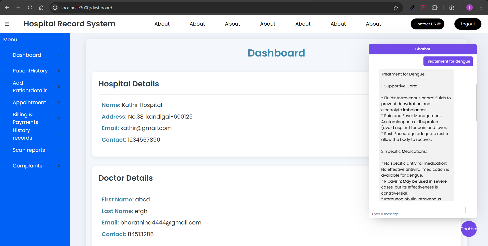

# HCL

#  Medical Record Tracker for Hospital
 The Medical Record Tracker for Hospital is an integrated platform designed to streamline and enhance the efficiency of healthcare facilities. This comprehensive system allows for the secure management of patient records, appointments, and medical histories. 

## Key features include:

1. Patient Record Management: Effortlessly maintain and access patient records, including personal information, medical history, and treatment details. Ensure data security and privacy compliance.

2. Appointment Scheduling: Simplify the process of booking and managing patient appointments, reducing wait times and improving patient satisfaction.

3. Doctor Scheduling: Organize doctors' schedules, ensuring optimal utilization of resources and better patient care.

4. Chatbot for Assistance: Integrated with a user-friendly chatbot, the system provides instant support to healthcare professionals. The chatbot is designed to clear doctors' doubts, offer quick access to medical guidelines, and facilitate communication, enhancing the overall workflow within the hospital.

5. Role Based Access Control

This aims to provide a robust solution that enhances patient care while streamlining administrative processes.

## How to Run
1. Clone the repository
2. Create Environment variables
```.env
MONGO_URI = 
PORT = 
JWT_SECRET = 
JWT_EXPIRES_IN=30d
GEMINI_API = 
```
3. Go to backend directory
4. Run the commands
```node
npm install
npm start
```
5. Go to frontend directory
```node
npm install
npm start
```

## Gallery

#### Home Page


#### Dashboard


#### Add Patient


#### Add Doctor


#### Appointment


#### Appointment Confirmation


#### Doctor Credentials


#### Login Page


#### Signup Page
